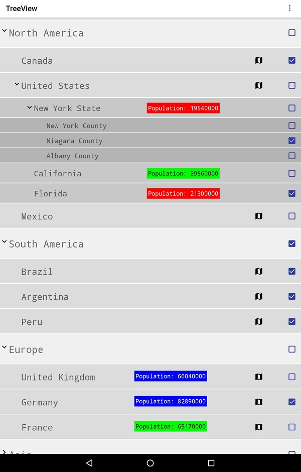

This git repository is a fork of the following repository:
https://github.com/shineM/TreeView

The current demo app at the above original repository are using strings as the TreeNode content
( e.g. "Parent  No.4"  , "Child No.8" , "Grand Child No.3" and so on )  
and it uses three levels with a different layout file for each level.

This branch provides a sample which instead uses instances of a class ( named 'GeographicArea' ) as the TreeNode content.
The sample app can also show more levels than three, and all levels use the same layout file.
Instead of using different layout files, the layout differences are handled programmatically, i.e. hiding content (with 'setVisibility(View.INVISIBLE)' ) and changing colors, margins, heights, font sizes.

Please note that this is NOT a sample for showing how to create a pixel perfect Android GUI looking good at different screen resolutions.
 
The image below is a screenshot of the sample when using a tablet (i.e. a real device and not an emulator).
A clickable map icon is shown to the left of the checkbox for each country i.e. always when country is the geograhic level.
A population size is shown for those geographic areas that have been defined with a poulation i.e. regardless of the geograhic level (e.g. some states in the United States or some countries in Europe).  
The background colors for the population is depending on the population size (red: less than 30 millions, green 30-66 millions, and blue for more than 66 millions)
There is no reason for the above mentioned population values, other than just making some values green and some blue and some red.

Below is a screenshot showing the 
 